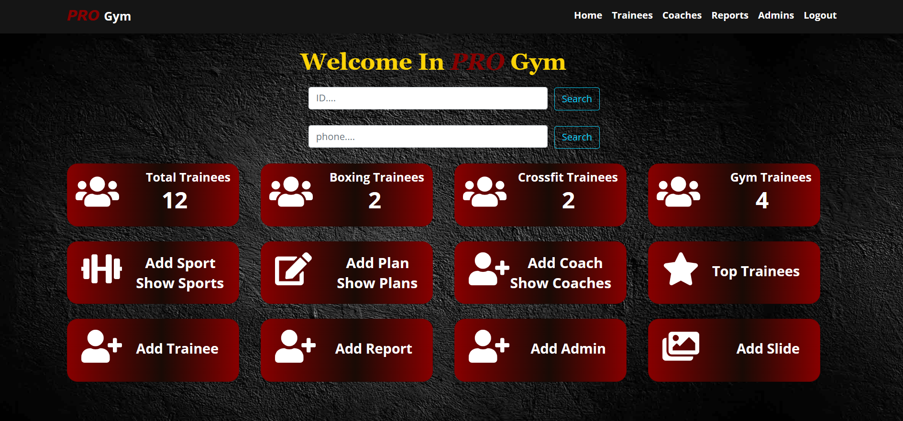

# Gym-Management-System
> A Pro Gym is gym management system  which is basically software that is designed to seamlessly integrate all aspects of your business, allowing you to more easily and efficiently run your facility..
>- Video demo [_here_](https://drive.google.com/file/d/1-S_tQF2ukU6UFf2bhzivEAkU_ZEhGxqR/view?usp=share_link).

## Table of Contents
* [General Info](#general-information)
* [Technologies Used](#technologies-used)
* [Features](#features)
* [Screenshots](#screenshots)
* [Project Status](#project-status)

## General Information
- It is a system to manage and track your trainees,trainers and their plans and sports
- It provides to you membership management
- Check-in and visit tracking through number of classes to each trainee
- Manage and make weekly or monthly report

## Technologies Used
- Front End - HTML , CSS , Jquery, Bootstrap
- Back End -  C# , ASP.NET MVC , SQl Server , Linq , Entity Framework

## Features
- The main objective of the project is to develop software that facilitates thedata storage, data maintenance and its retrieval for the gym in an igneous way
- To store the record of the customers, the staff that has the privileges toaccess, modify and delete any record and finally the service, gym provides toits customers
- Manage all trainees business
- Manage all trainers business
- Crud Operations on all entities such : edit plan or add new plan 
- Dynamic business to trainers to put their plans and sports

## Screenshots

## Project Status
Project is: _complete_ 
